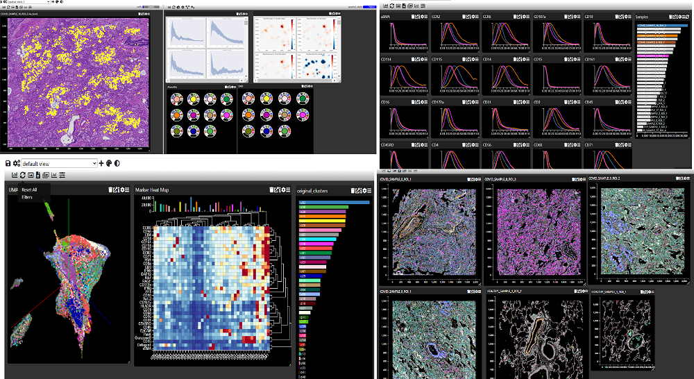

# Multi Dimensional Viewer


Multi Dimensional Viewer (MDV) is web based application for analyzing, annotating and sharing multi-dimensional data from different modalities.  It is inspired by [dc charts](https://dc-js.github.io/dc.js/) and [crossfilter](https://square.github.io/crossfilter/), but is performant with over 10 million data items due to the use of web workers, shared array buffers and native arrays.  
&nbsp;



## Key Features

* Large assortment of interactive charts/widgets may be used and embedded in an analysis. These include:
    * Scatter plots (2D and 3D)
    * Box plots
    * Heat maps
    * Histograms
    * Pie charts
    * Violin plots
    * Annotation tools
    * Interactive spatial biology charts 

* Multiple views or pages of data may be created to tell a story with the data

* Charts/Widgets can pop out into separate windows to take advantage of multiple screens

* Multiple data sources (tables) and can loaded and links defined between them

* Data can added and/or modified by the user

* Diverse range of data sources (API calls, static files) can be used by implementing custom data loaders 

* Runs in a web browser (installation not required for uploading and viewing data)

### System Requirements

For running a release version:

* A modern browser
* python (3.6 or above)
* only 4GB of ram is required even for large datasets (~10 000 000 items) as data is lazily loaded as raw bytes
* `htslib` is required only for Genome Browser functionality.

For development, or running the current version from the repository:

* git
* node.js
* python (3.12)
* poetry (for managing python dependencies - optional, but recommended especially for contributing to the Python code)

## Running On Local Machine

If you have large amounts of data or projects you may wish to install MDV locally. MDV is written JavaScript designed to be embedded in a web page (https://mdv.molbiol.ox.ac.uk/). However in the python directory of this repository, there are some python scripts to format data to a specific file structure and compiled JavaScript that can display that format. There is also a lightweight server that runs locally to display projects

### Installation

#### From a GitHub release version

Download and unzip, this should be able to work without requiring node to be installed etc.

-- this needs better documentation, and I might want to make a new release soon...

#### For development / using latest features

Clone the repository

```
git clone https://github.com/Taylor-CCB-Group/MDV.git
cd MDV
git checkout pjt-dev
```

Then, from the MDV folder:

Install front-end dependencies

```
npm i
```

Setup Python virtual environment and build the front-end that it will use. On Unix-like systems, there is an npm script that will do this automatically, as long as you have Python 3.12 installed and [Poetry is available in your PATH](https://python-poetry.org/docs/#installation):

```
npm run python-setup
```

This will be equivalent to the following:

```
python -m venv venv
source venv/bin/activate
cd python
poetry install --with dev
npm run build-flask-vite
```

On Windows systems, the `source venv/bin/activate` will not work - activating the environment is done by running `venv/Scripts/activate.bat`.

If you don't want to use `poetry`, or wish to manage your own virtual environment, you can install `mdvtools` with `pip` (using `editable` flag for development):

```
pip install -e python
```

**or**, if you are happy with `poetry` but want to manage the virtual environment yourself:

```
cd python
poetry install --with dev
```

### Running a test project


This example will build and run a project based on the `pbmc3k_processed` dataset from `scanpy`:

```
python python/mdvtools/test_projects/scanpy_pbmc3k.py
```

...homework: make a script (or notebook) that runs example

### Displaying example data (old doc)
download the  data

https://zenodo.org/record/6513508/files/hyp_example_data.zip?download=1

Then cd to the python directory

```
cd path/to/mdv/python
```

Open a python shell
```
python
```

Create an MDV project from the downloaded folder and display it in a browser:

```python
from mdvtools.mdvproject import MDVProject
p = MDVProject("/path/to/hyp_example_data")
p.serve()
```

This will open a browser window at http://localhost:5000/ but you will need to go to
[http://127.0.0.1:5000](http://127.0.0.1:5000) to avoid permissions errors. Note that this will fail if the front-end code has not been built after checking out the repository - `npm run build-flask-vite` to update it, or use a release version which should have the necessary build output already present in `python/templates/static`.

## Running on a server


The default data storage is an hdf5 file which is a compressed files that allows random read/write access to the data. However, it cannot be accessed directly but requires some kind of wrapper e.g. h5py. Hence access via http calls directly is not possible and backend code is required to display an MDV project in a web page. However, it can be converted to simple continuous compressed blocks of data for each column and a json index . This allows direct access via an http request with a range header:-

```python
from mdvtools.mdvproject import MDVProject
p = MDVProject("/path/to/hyp_example_data")
p.convert_to_static_page("/path/to/myapp/")
```

The function also creates a simple home page for the project (index.html), which can be customized. The folder can then be put on the server and accessed via:-
```
https://myserver.com/path/to/myapp
```


## Development

* clone the repository
* npm install

### Git blame without formatting commits

The `.git-blame-ignore-revs` file is used to ignore commits when running `git blame`. This is useful for ignoring formatting commits when trying to find the original author of a line of code. To use it, run:

```bash
git config -e
```

And add the following lines:

```toml
[blame]
	ignoreRevsFile = ".git-blame-ignore-revs"
	markIgnoredLines = true
```

Mark ignored lines will prepend a `?` to the blame commit hashes for indirectly blamed lines.

### note - this documentation is somewhat deprecated - [for dev-branch](#dev-branch)

You can run a project in development mode, which allows you do debug the JavaScript code and make changes, which will be reflected in the browser.

To use a project that has been converted into a static webpage (`convert_to_static_page()`) just specify the location of the folder when you start the dev server.

```
webpack serve --env dev=folder:/path/to/myproject
```
Or you can use data that is being served from a project. Run `serve()` on a project, which by default will start a server on local host at port 5050, and then start the development server

```
webpack serve --env dev=http://127.0.0.1:5050
```
In both cases the server will be running at localhost:8080

### Building the App
```
npm run build-flask-vite
```

#### note - this documentation is somewhat deprecated - [for dev-branch](#dev-branch)

This will build JavaScript that is is suitable for use with the 'static' project format and the lightweight inbuilt server in the python module. It puts the JavaScript files and assets in python/mdvtools/static/js and python/mdvtools/static/img respectively. When a static project is created, these files are copied over to the project's folder so that it can run independently.

```
webpack --env build=production
```
The above will build the JavaScript code and exposes ChartManager and a few utility methods for loading data, but it is up to the developer to write methods to load/save data to the app. The js files are put in dist/basic and any assets in dist/basic/images.


There are a few options to customize the production build:-
* mode - by default the mode is production which minifies and optimizes the bundled code. If development is specified, more verbose, easier to debug code is generated
* outputpath - the default is dist/basic , but any folder can be specified
* assetpath - this is the path where the app will look for assets, by default it is ./, so the generated images folder needs to be placed in the same directory as the html page. It can be changed to a relative or absolute path e.g. /static/assets/js, in which case the images folder will need to be places the relevant location on the server
* nofont - if true then fontawesome will not be included in the build, it will need to be imported in the html file

```
webpack --env build=production mode=development \
              outputpath=/path/to/myfolder \
              assetpath =/static/assets \
              nofont=true \
```

## Dev branch

The 'pjt-dev' branch is currently being used for development. It is automatically deployed to https://mdv-dev.netlify.app/ when a commit is made to the branch.

This documentation, and some aspects of how things are arranged, should be considered a work in progress.

The index page can load data either served by the `mdvtools` module, or with static data from another server (specified with a `static` flag in the URL). In either case, a `dir` parameter is used to specify the location of the data.

For example, the following URL will load data from a static server in the current dev deployment:

[`https://mdv-dev.netlify.app/?static&dir=https://mdvstatic.netlify.app/ytrap2`](https://mdv-dev.netlify.app/?static&dir=https://mdvstatic.netlify.app/ytrap2)


This will look for files `datasources.json` etc. as generated by python at the URL `https://mdvstatic.netlify.app/ytrap2`. A server running on localhost can also be used to serve this static data, as long as it sets appropriate CORS headers. At no point will any data loaded into the system in this way be uploaded to any server.

To work on developing the JS client code in this branch, we are using Vite rather than WebPack, and the dev server can be run with `npm run dev`. The `index.html` file is intended to be usable without requiring a custom JS entrypoint for a given project, although if desired, other configurations options are available.

This server runs on `localhost:5170` and behaves similarly to the Netlify deployment, but with Hot-Module-Reloading of compatible parts of the client code, and the ability to proxy to a local `mdvtools.mdv_desktop` server, which is intended as a simple way to have multiple local projects running in the same development environment.

The same project running in a local dev-server can be accessed at `http://localhost:5170/?static&dir=https://mdvstatic.netlify.app/ytrap2`.

### `mdvtools` servers

With the `mdvtools` module installed in a Python environment, there are two servers that can be run to serve MDV projects locally. They can be used either as main entrypoints, invoked from the command line, or from within other scripts.

There is a helper npm script `npm run python-setup` that will create a virtual environment and install the `mdvtools` module. This doesn't currently work on Windows, but the `mdvtools` module can be installed manually with `pip install -e .` in the `python` directory.

#### `mdvproject`

```bash
(venv) $ python -m mdvtools.mdvproject /path/to/project
```

This will start a server that serves the project at `http://localhost:5050/`, and automatically open it in the default browser.

#### `mdv_desktop`

```bash
(venv) $ python -m mdvtools.mdv_desktop
```

Starts a server that serves projects from a `~/mdv/` directory. This is intended to be a simple way to run multiple projects in the same development environment without needing to restart etc, and is not intended for production use. It will also read a `config.json` file in the `mdv` directory which currently only contains a list of locations for other projects outside of the `mdv` directory - for instance, on an external volume.

This is currently hard-coded to run on port `5051`, and can be used with or without the Vite dev-server (running without the dev-server requires an initial `npm run build-flask-vite` to build the JS used in Flask templates).

### Vite configuration

The Vite configuration is found in `vite.config.mts`, and will behave differently depending on environment variables.

#### `build` environment variable: `'production' | 'dev_pt' | 'desktop' | 'desktop_pt'`

As of this writing, the ones ending `_pt` generally relate to builds using newer dev-branch features, while `production` and `desktop` mirror legacy WebPack configurations.

