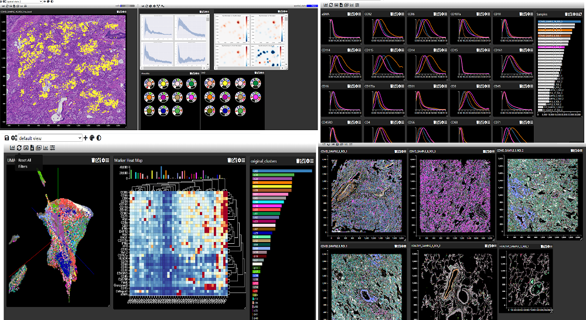

# Multi Dimensional Viewer


The Multi-Dimensional Viewer (MDV) is a web-based application designed to help users analyse, annotate, and share multi-dimensional data from various sources (e.g., biological, statistical, etc.). MDV supports fast, interactive analysis even with large datasets (up to 10 million data items), thanks to its use of web workers, shared array buffers, and native arrays.
&nbsp;



## Key Features

* Large assortment of interactive charts/widgets may be used and embedded in an analysis. These include:
    * Scatter plots (2D and 3D)
    * Box plots
    * Heat maps
    * Histograms
    * Pie charts
    * Violin plots
    * Annotation tools
    * Interactive spatial biology charts 

* Multiple views or pages of data may be created to tell a story with the data

* Charts/Widgets can pop out into separate windows to take advantage of multiple screens

* Multiple data sources (tables) and can loaded and links defined between them, for instance refering to gene expression matrix data in cells

* Data can added and/or modified by the user (for example, to edit annotations)

* Diverse range of data sources (API calls, static files) can be used by implementing custom data loaders 

* Runs in a web browser (installation not required for uploading and viewing data)

### System Requirements

- **Browser**: A modern browser (e.g., Chrome, Firefox, Safari, or Edge)
- **Memory**: At least 4 GB of RAM, even for handling large datasets (~10 million items), due to the lazy loading of data in raw bytes

For information about using MDV and uploading your data please go to the [MDV Website](https://mdv.ndm.ox.ac.uk/).

To install MDV using Docker see [MDV Installation](https://mdv.ndm.ox.ac.uk/docs/installation/installation-manual).

You can browse existing projects an old [MDV Projects Website](https://mdv.molbiol.ox.ac.uk/projects)

### For Development or Running a Local Version from the Repository:

The canonical way of developing the application as of this writing is to use a [devcontainer](https://containers.dev/), which standardises the development environment and dependencies.

In this case, the prerequisites are:
- **Git** for cloning the repository and version control
- **Docker** for containerising the application and related dependencies
- **VSCode or similar, with devcontainer extension** this will automatically detect the presence of devcontainer configuration and use it to configure the appropriate Python interpreter and other tooling, such as linting for front-end and back-end code.
- **WSL if running in Windows** there can be filesystem issues with Docker in Windows, and it is recommended to clone the repo into a WSL distro in this case.

```sh
git clone https://github.com/Taylor-CCB-Group/MDV.git
cd MDV
code .
```

This should display a prompt to re-open in a devcontainer, which will initially take a few minutes to build and then open a server on http://localhost:5055.

For front-end development, a vite dev-server can be started with `pnpm run dev` from a terminal in the container. The main front-page for that is accessed at http://localhost:5170/ by default, and you can pick another port with `pnpm run dev -- --port <port>`.


### Alternative steps for running locally

If you prefer to manage tools differently - for a lighter-weight environment, non VSCode-based editors, or integration into other workflows etc, this is also possible. Further documentation can be found on the [MDV documentation website](https://mdv.ndm.ox.ac.uk/)

## Deployment Scripts (Local Docker)

The repository includes three deployment entrypoints:

- `deploy.sh`
- `deploy.bat`
- `deploy_gui.sh`

All three support:

- database backend selection (`sqlite` default, `postgres` optional)
- deployment mode (`new` or `replace`)
- deployment name (Compose project name)
- custom app host port
- automatic suggested host port (next free from `5055`)

### Backend behavior

- **sqlite (default)**:
  - runs `mdv_app` without `mdv_db`
  - uses `SQLITE_DB_PATH` (default `/app/mdv/mdv.sqlite3`)
- **postgres**:
  - runs `mdv_app` + `mdv_db`
  - postgres container is pinned to `mdv-db` for easier reuse detection across deployments
  - uses `DB_USER`, `DB_PASSWORD`, `DB_HOST`
  - uses a shared database name `mdv` by default
  - sets `DB_SCHEMA` to the deployment name by default
  - can also run in **reuse** mode (app only), where `mdv_db` is not started and `DB_HOST` points to an existing Postgres instance
  - deploy scripts auto-detect running Postgres containers and default to `reuse` mode when found

At startup, application logs will include the selected backend (for example `Database backend selected: sqlite (...)`).

### Running multiple deployments side-by-side

To keep multiple instances without replacing an existing one, use:

- mode: `new`
- a unique deployment name (for example `mdv_a`, `mdv_b`)
- different host ports (for example `5055`, `5056`)

Each deployment writes its own env file (`.env.<deployment_name>`) and runs under its own Compose project name.

### Local image vs Docker Hub image

Deploy scripts now prefer a local `mdvadmin/mdv:stable` image if it already exists, and skip pulling `mdv_app` in that case.

If no local image is available, scripts pull from Docker Hub as before.

To test local code changes:

```sh
docker compose -f docker-local.yml build mdv_app
```

Then run your deploy script and choose backend/settings as needed.
