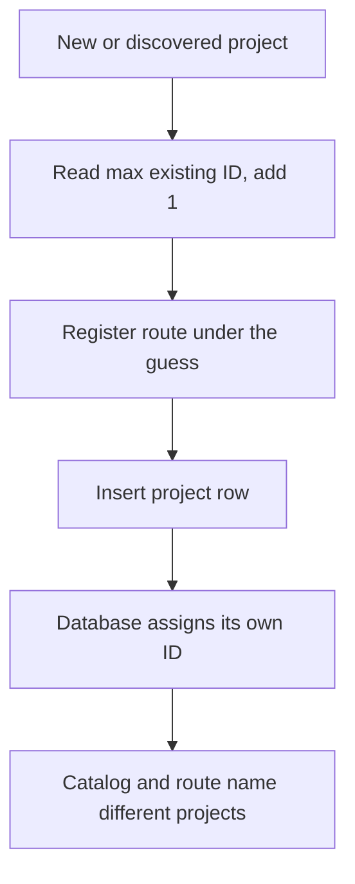
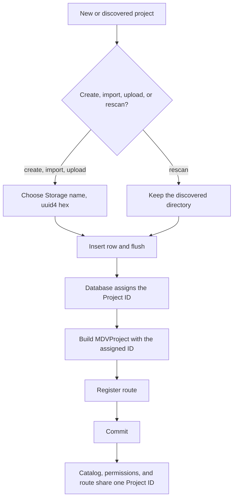
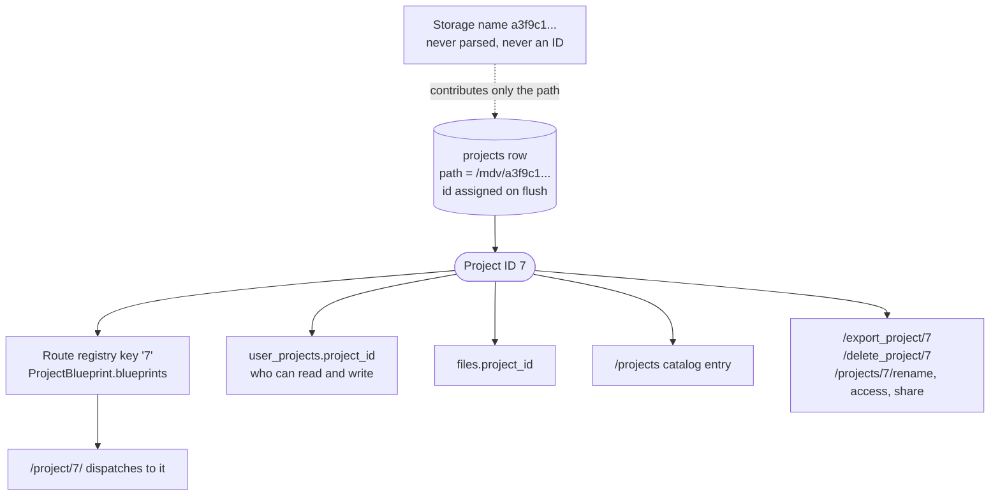
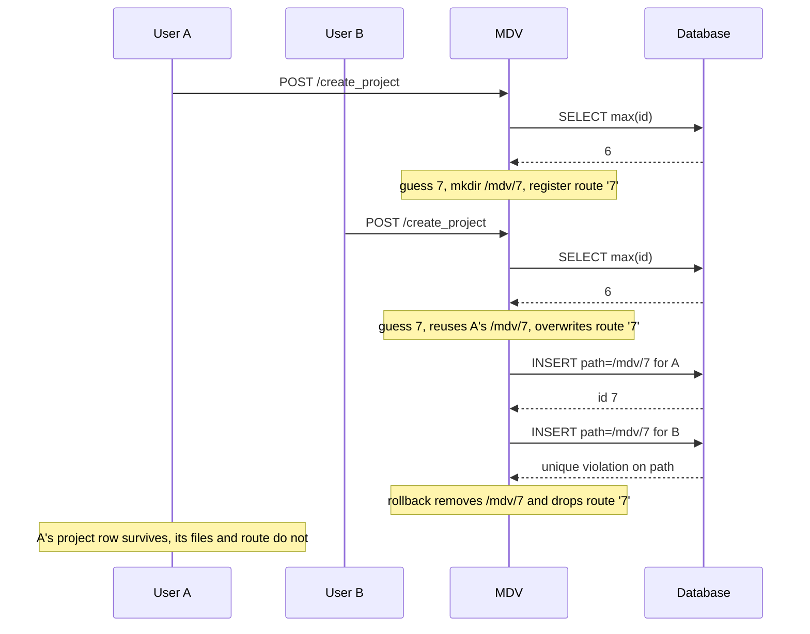
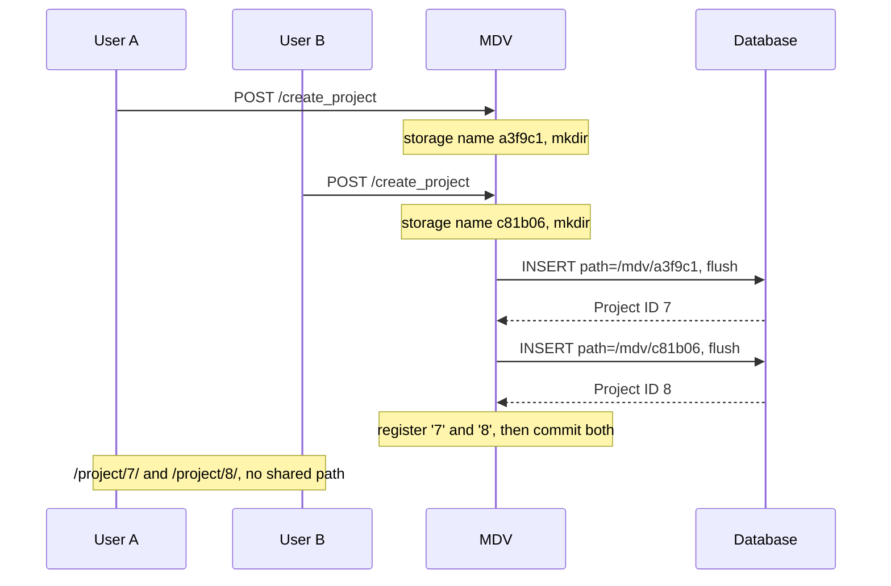
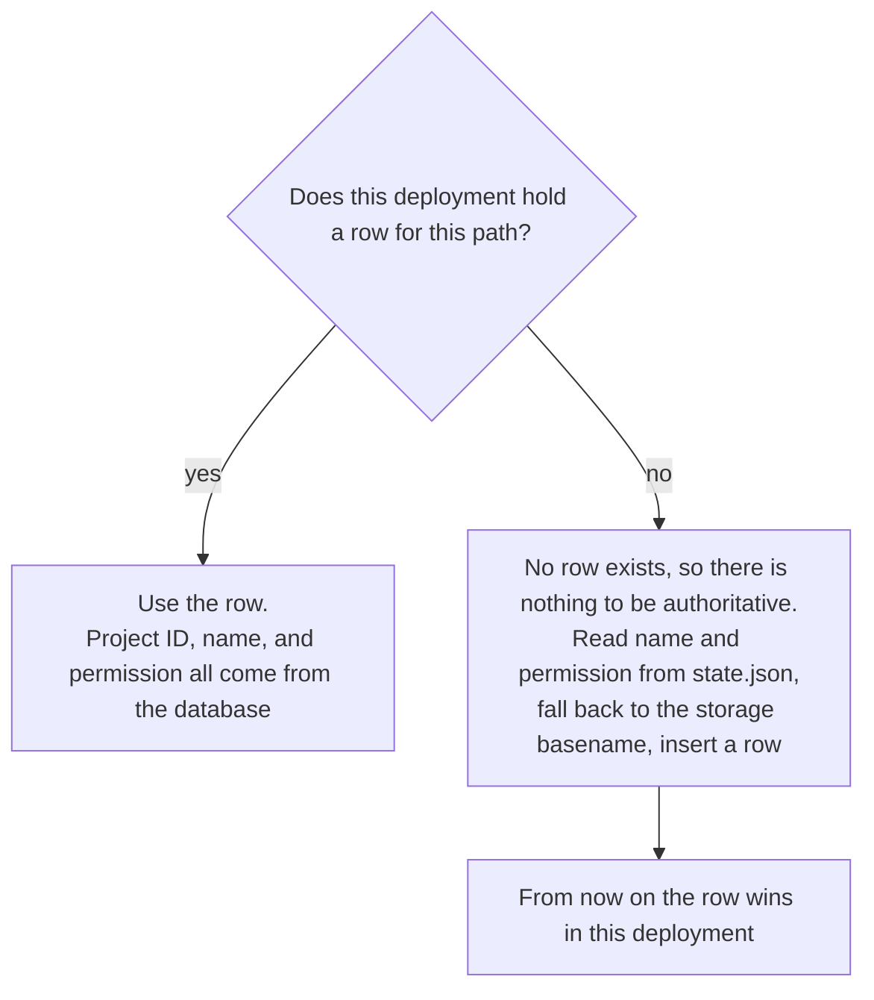
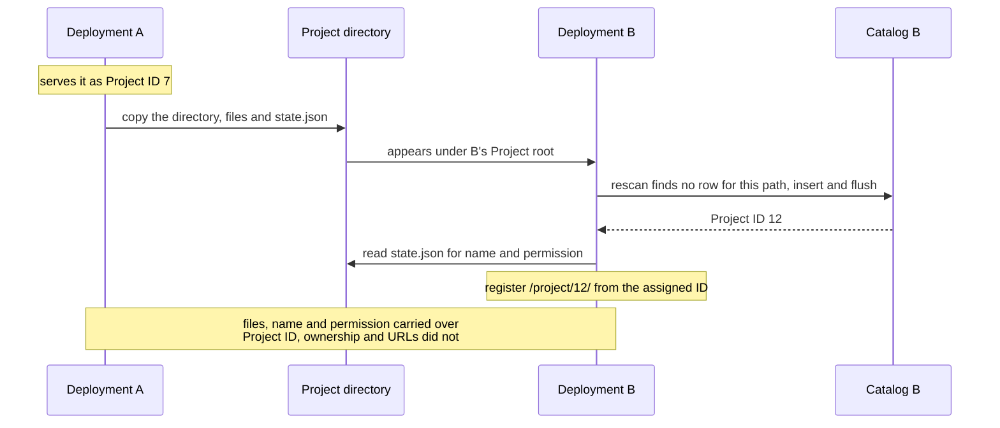
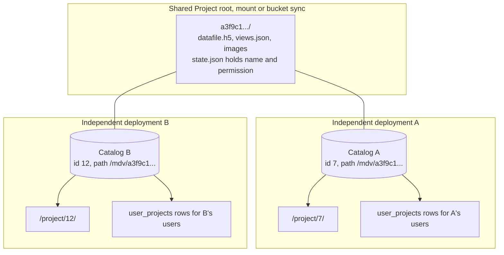

# Keep Project IDs local to each deployment

**Status:** proposed

## Context and decision

Four code paths create a project row. All four guess the id before the database
assigns one. They read `max(Project.id) + 1`, register `/project/<guess>/`, then
insert and let the database pick its own value:

- `create_project` (`dbutils/project_manager_extension.py:69`)
- `import_project` (`dbutils/project_manager_extension.py:170`)
- the zip upload (`file_processing.py:319`)
- rescan (`dbutils/mdv_server_app.py:487`)

PostgreSQL sequences do not rewind after a delete, so the guess and the assigned
value disagree and the route names a different project from the catalog. That is
roadmap issue 26, and it needs no concurrency at all. A second failure mode needs
two users: the guess and the insert are separated by directory creation, JSON
writes and route registration, and `patch_psycopg()` (`dbutils/mdv_server_app.py:25`)
makes every PostgreSQL round trip a gevent yield point, so two requests interleave
inside a single worker.

**The database assigns the Project ID. Nothing predicts it.** Every path inserts
the row, flushes to read the assigned value, registers the route from that value,
then commits. `get_next_project_id()` is deleted.

**Project IDs are never reused.** PostgreSQL already guarantees this. SQLite does
not, because `INTEGER PRIMARY KEY` hands back `max(rowid)` after the highest row is
deleted, so `sqlite_autoincrement` is set on the projects table to match.

**Project IDs are local to one deployment.** Two Independent MDV deployments that
share a Project root, by mount or by bucket sync, assign different Project IDs to
the same files. A project URL does not carry between them.

**New project directories get an opaque Storage name.** A `uuid4().hex`, chosen
before the row exists. A folder basename is never read as a Project ID.

**The database is authoritative for every project it holds a row for.** The project
directory carries a Recovery copy of the fields a rescan needs to rebuild a row: the
display name and the permission, both in `state.json`. That copy is read only when
no row exists. Anything that writes one of those fields writes both.

## Project ID allocation

Today every path predicts an id, registers the route under the guess, then lets the
database assign a different integer.



After this change the database assigns first and everything downstream uses that
value.



The sequence is the same on all four paths:

```python
storage_name = uuid.uuid4().hex
project_path = os.path.join(base_dir, storage_name)
os.makedirs(project_path)
# import and upload: extract or copy files into project_path

new_project = ProjectService.add_new_project(path=project_path, name=name)  # add + flush
p = MDVProject(dir=project_path, id=str(new_project.id), backend_db=True)
p.set_editable(...)
p.set_display_name(new_project.name)   # state.json
p.serve(app=app, open_browser=False, backend_db=True)
db.session.commit()
```

`ProjectService.add_new_project` changes from `commit()` to `flush()`, and its
callers own the commit. All five of its call sites are the four paths above. Rescan
keeps its commit inside the per-project loop, so one bad directory cannot roll back
the whole scan and a failed scan can be re-run.

On failure: pop `ProjectBlueprint.blueprints[str(new_project.id)]`, remove the
storage directory, roll back the session.

`os.makedirs` loses its `exist_ok=True`
(`project_manager_extension.py:172`, `file_processing.py:324`). With a guessed id
that flag let an import extract into a directory that already held another project.

## Three names, and which is which

Today the Project ID and the directory name are the same string, because the code
guesses a number and uses it for both. That is the coupling this ADR removes. After
the change the Project ID never appears on disk, and the directory name never
appears in a URL.

| Name | Example | Where it lives | Who reads it |
| --- | --- | --- | --- |
| Project ID | `7` | `projects.id` | the URL, the Route registry key, `user_projects`, `files`, the catalog |
| Storage name | `a3f9c1d2e8b4471aa1f0c2d3e4f5a6b7` | the directory name under the Project root | nothing parses it |
| Path | `/app/mdv/a3f9c1d2e8b4471aa1f0c2d3e4f5a6b7` | `projects.path` | the only thing joining the other two |

On disk and in the catalog:

```
$ ls /app/mdv
a3f9c1d2e8b4471aa1f0c2d3e4f5a6b7/
c81b06e4f9a24d3ea7c5b0119de2f480/
```

```
SELECT id, name, path FROM projects;
7 | Tumour atlas | /app/mdv/a3f9c1d2e8b4471aa1f0c2d3e4f5a6b7
8 | Pilot cohort | /app/mdv/c81b06e4f9a24d3ea7c5b0119de2f480
```

A request for `/project/7/` looks `7` up in the Route registry, finds the
`MDVProject` built from `/app/mdv/a3f9c1.../`, and serves it.

The directory name cannot come from the Project ID once a Project root is shared.
Deployment A calls that directory project 7 and deployment B calls it project 12, so
a folder named after the id would have to be called `7` and `12` at the same time.
It gets a name that belongs to neither catalog instead.

Existing numeric directories are not renamed, so a Project root will hold a mix of
old numeric names and new opaque ones. Neither is parsed. `Project.path` is read in
both cases.

## Where the Project ID goes

One value, assigned once, used everywhere. The Storage name reaches the database as
a path and stops there.



## Two users creating a project at the same time

Today the second create destroys the first project. Both users guess the same id, so
both get the same directory path. `MDVProject` does not clear a directory that
already exists (`delete_existing=False`), `Project.path` is unique, and the losing
request's rollback deletes the shared directory and drops the shared route.



After the change the two requests never touch the same path and never guess the same
number. Each one asks the database and is told.



## Which wins, the database or the directory

The directory is not a second source of truth. It is what a rescan reads when this
deployment has nothing to read.



Anything that writes the name or the permission writes both sides. `rename_project`
writes the row and `state.json`. `/projects/<id>/access` writes the row and
`state.json`. The database write decides whether the request succeeded, and a failed
disk write is logged rather than fatal, matching `set_editable`
(`mdvproject.py:266`).

## Moving a project between deployments

Copy the directory, run rescan. That works today and keeps working. What changes is
that the receiving deployment stops guessing, and the project arrives with its real
name instead of its folder name.



Export and import behave the same way. `export_project` archives the whole project
directory, so `state.json` travels inside the zip. Any path that creates a row
without a supplied name reads `state.json["name"]`, and falls back to the storage
basename only when the disk has nothing.

Ownership does not travel, because `UserProject` rows are keyed on a
deployment-local `User.id`. On the receiving side an admin grants access, which is
what the rescan admin permissions change does automatically.

## Two deployments sharing one project directory

This is the Workbench shape: separate applications, separate databases, one set of
files reached by mount or bucket sync. Each catalog assigns its own Project ID to
the same directory, and that is intended.



What follows from this:

- The same project is `/project/7/` on A and `/project/12/` on B. Neither URL works
  on the other deployment. Sharing a link means sharing a deployment.
- Permissions are per deployment. A user granted access on A has nothing on B.
- Both deployments write the same files. Last writer wins, and because all views
  live in one `views.json`, the loser loses the whole file.
- Once both have rows, each keeps its own display name, because the database wins
  for a project it knows about. The copy in `state.json` is whichever deployment
  renamed last, and it is what a third deployment, or a rebuilt catalog, will read.
- If A purges the project, the files go and B is left with a row pointing at a
  missing path. B logs it as a failed project at startup.

## Why UUIDs are deferred

A UUID generated before the insert would also make the route and the row agree, and
it would survive sequence gaps. It is a larger change than the bug needs: the
primary key, the foreign keys from `UserProject` and `File`, every `<int:project_id>`
route converter, the frontend types, and a migration for live PostgreSQL and SQLite
deployments.

It would also not, on its own, give the property people expect from it. Look at the
shared directory diagram above: a UUID makes A and B agree on an identity only if
that UUID is persisted with the on-disk project and treated as global, which is a
further decision about what a shared directory means, and it brings the permission
and ownership questions with it.

The defect in issue 26 is prediction before assignment, not the integer type.
Deferred, worth revisiting when there is a reason to make project identity global.

## Considered and rejected

- **Guess `max(id) + 1`, then insert.** Current behaviour. Wrong on PostgreSQL after
  any delete, and destructive when two creates interleave.
- **Insert first, but only in rescan.** The fix direction in issue 26. It fixes the
  reported symptom and leaves create, import and upload naming directories from a
  predicted id.
- **Name the directory after the assigned Project ID.** Needs a rename after the
  insert, or an insert with a placeholder path, and it puts back the coupling
  between folder name and id. In a shared Project root two deployments would both
  want the folder called `7`.
- **Write the Project ID into the directory as a marker file.** In a shared Project
  root two deployments write different ids into the same directory, and the loser's
  marker becomes a trap for whoever reads it next. Operators map a project to its
  files through `Project.path` or the creation log line.
- **A name derived from the project title, such as `my-analysis-a3f9c1`.** Friendlier
  in a file browser, stale the moment someone renames, and a folder name that looks
  meaningful invites people to parse it again.
- **`tempfile.mkdtemp`.** Collision-free, but it creates directories mode 0700, which
  breaks a Project root shared with a deployment running as another user.

## Consequences

- Project IDs are deployment-local. Links and bookmarks do not carry between
  deployments, and export then import into another deployment produces a new
  Project ID.
- Storage names carry no information. An operator maps a project to its directory
  with `SELECT id, name, path FROM projects`, or from the log line each creation
  path writes with the assigned Project ID and the storage name together.
- No row migration and no directory renames. Numeric and opaque directory names
  coexist. `sqlite_autoincrement` only affects `CREATE TABLE`, so existing SQLite
  databases keep reusing ids until the table is rebuilt. There is no migration
  tooling in this repo, only `db.create_all()` (`dbutils/mdv_server_app.py:90`), so
  that rebuild is a one-off script.
- The startup sync at `dbutils/mdv_server_app.py:395-400` currently overwrites
  `Project.access_level` from `state.json` on every boot, while
  `/projects/<id>/access` writes only the row. Setting a project read-only and
  restarting reverts it. Under the authority rule that is a bug: `/access` writes
  both, and the startup sync only fills an access level the row does not have.
- The Route registry (`ProjectBlueprint.blueprints`) is process-local, so runtime
  project creation requires a single worker. `Dockerfile:165` runs `-w 1`. Making
  MDV run more than one worker needs the permission and catalog caches in
  `auth/authutils.py` addressed as well, and is not decided here.

## Later work

Two pieces of work follow from opaque storage names. This ADR decides neither of
them, and the change ships without both.

### An ls command for the catalog

Once a directory name carries no information, an operator with a shell needs the
database to find a project's files. `SELECT id, name, path FROM projects` gives the
mapping, and every creation path logs the same pair, so the information is there.
Doing it by hand each time is slow enough that a command earns its place.

MDV already ships a CLI, so this is a subcommand. `python/pyproject.toml:91`
declares `mdvtools = "mdvtools.cli:cli"`, and `mdvtools/cli.py:34` is a click group.
`mdvtools ls` would print the Project ID, name, storage name and path for every
project under a given Project root.

The catalog sits behind the `app` extra, which shapes how this gets built.
`dbutils/dbmodels.py` opens with `require_extra("app", "flask_sqlalchemy")` while the
CLI ships in the slim core, so a command that reads the database has to guard that
import the way ADR 0001 describes and tell a slim install to add `mdvtools[app]`. A
version that reads `state.json` from each directory would run on any install and
print names without Project IDs.

### Duplicating a project

MDV has no duplicate action today. Anyone who wants a copy exports the project and
imports the zip back.

Copying the directory at the shell works. `cp -r` produces a second directory,
rescan gives it its own Project ID, and both projects serve. The catalog then shows
two entries under the same display name, because the copy carries the original's
`state.json`, so whoever ran the copy has to rename one of them afterwards.

Using `mv` breaks the project, and people should be warned about it. The old path
disappears, so the existing row points at a directory that has gone and becomes a
failed project at startup, while rescan creates a second row for the new path. You
end up with one broken catalog entry alongside a new project that has lost its
ownership and permissions.

A duplicate action in the UI would follow the same sequence as create:

- choose a fresh storage name
- copy the directory
- insert a row and take the Project ID the database assigns
- write a distinct display name into the copy's `state.json`

`Project.path` is unique, so two rows can never share one directory and a duplicate
is always a real copy on disk. Whether the copy inherits the original's permission,
and who owns it, stay open.
