# Multi-Dimensional Viewer (MDV) Documentation

## Summary

Multi-Dimensional Viewer (MDV) enables the user to visually inspect and query the underlying data from omics experiments such as **scRNA-seq**, **scATAC-seq**, **spatial transcriptomics**, and **spatial proteomics**. Users can upload **tabular data** (.csv/.tsv), **AnnData** (.h5, .h5ad), or **image files** (.ome.tiff) and interactively filter, sort, and visualize them.

Each MDV project consists of multiple **Views**, which contain tables of data that can be queried and visualized. Views can be thought of as dynamic slides in a presentation, helping users tell a story with their data using various visualization tools.

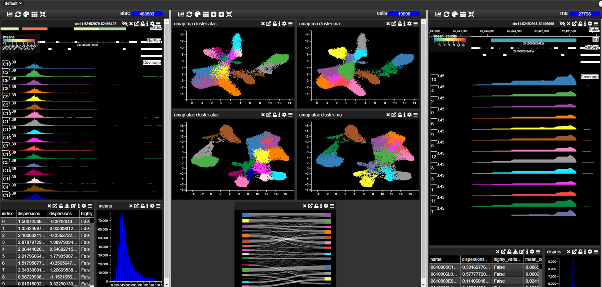

---

## Creating a Project

### Uploading Data

#### Supported File Types
- **Tabular data:** CSV (.csv), TSV (.tsv)
- **AnnData files:** H5 (.h5), H5AD (.h5ad)
- **Image data:** OME-TIFF (.ome.tiff)

#### Uploading a File
1. Navigate to your created project.
2. Drag and drop the file into the upload box.
3. Preview the file contents and click **OK** to upload.
4. Large files (>2GB) should be uploaded via the API.

Once uploaded, the data is displayed in appropriate views:
- **Tabular data** appears as a single table.
- **AnnData** splits into a **cell table** and **gene table**.
- **Images** appear in the **image viewer**.

---

## Saving a Project
When tracks, graphs, or columns are added and you have edit permissions, they are **permanently** added to the project. However, layout changes (resizing, repositioning) are **not** saved automatically.

To save these layout changes:
1. Click the **Save** button ({height=20px}).
2. If working on a public project, select **Save As** to create your own copy.

---

## Adding Graphs/Charts

Charts help visualize data and allow intuitive filtering by selecting regions on plots or interacting with chart elements. Each filter automatically updates **all charts**, the **table**, and the **browser** to reflect the filtered data.

- **Move** charts by dragging the title bar.
- **Resize** charts using the icon at the bottom-right corner.
- **Remove** charts with the trash icon.

### Adding a Chart

1. Click **Add Chart**.
2. Select a **Chart type**.
3. Choose the **fields** to display.
4. **Name** the chart.
5. Adjust **settings** using the **gear icon ({height=20px})**.
6. The **palette icon** is used to select channels with spatial omics data **({height=20px})**.

#### Settings
Each chart may be customized in **settings**. Chart settings allow you to change properties such as title, description and which axes. There are often many options to change the underlying data and look and layout of the chart.  
Furthermore, for when changes axes it is possible to refer to a: 
1. Column in the same table
2. Link to a column in another table
3. Dynamically link to a column in another table

For example, a scatterplot is made based on the values of the column UMAP_1 and UMAP_2 in the "cells" table of an anndata object. The points in the UMAP maybe be coloured to reflect using the "Color by" setting to reflect: 
1. A property in the "cells" table.

2. The expression value of a particular gene in the "genes" table

3. The expression value of a particular gene in the gene table that automatically updates when you change the filter. You can also add multiple genes in the "genes" table and where the chart can display it (for example a dot plot of gene expression) you will see all the genes dynamically added to the chart.

---

## Supported Chart Types (Alphabetical)

Below is a list of all chart types in **alphabetical order**, with **context** (what each chart is typically used for), **inputs**, **settings**, and **hyperlinks** to example images stored in the **img/** directory.

---

### Abundance Box Plot

#### Examples

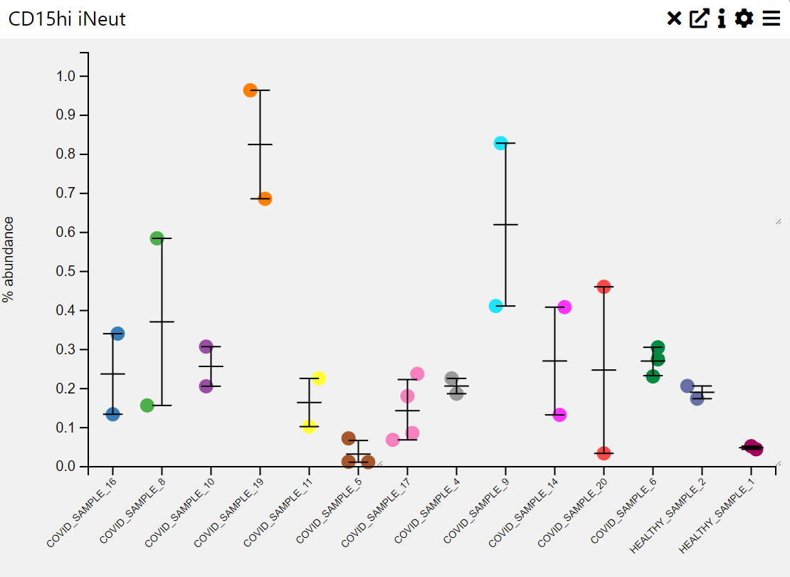{width=400px}

#### Context
An **abundance box plot** is used to visualize the distribution of numerical values across different categories, often representing abundance levels in a dataset. It provides insights into the **median**, **interquartile range**, **outliers**, and overall spread of values within each category.

#### Inputs
- **Category (X-axis, categorical variable)** 
- **Abundance Values (Y-axis, numerical variable)**

#### Settings
- **Chart Name** (customizable title)
- **Chart Legend** (define or modify legend text)
- **Sample Group** (choose how data is grouped)
- **Sample Selection** (filter or choose specific samples)
- **Categories** (define categorical labels for comparison)

#### Axis Controls
- **Rotate Y-axis labels** (toggle for readability)
- **Y-axis text size** (adjustable via slider)
- **Y-axis width** (adjustable via slider)
- **Rotate X-axis labels** (toggle for readability)
- **X-axis text size** (adjustable via slider)
- **X-axis height** (adjustable via slider)

#### Sorting & Display Options
- **Sorting Order** (default, by size, by name)
- **Max Categories** (limit the number of displayed categories)
- **Hide Zero Values** (toggle to exclude empty categories)
- **Tooltip Display** (enable/disable tooltips for additional information)

---

### Box Plot

#### Examples

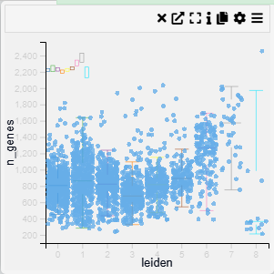

#### Context  
A **box plot** is a visualization used to summarize the distribution of numerical values across different categories. It highlights key statistical metrics such as the **median, quartiles, and outliers**, providing insights into the spread and variability of the data.

#### Inputs  
- **Category (X-axis, categorical variable)**  
- **Value (Y-axis, numerical variable)**  

#### Settings  
- **Chart Name** (customizable title)  
- **Chart Legend** (define or modify legend text)  
- **Band Width** (adjustable width for distribution smoothing)  
- **Intervals** (control the number of divisions in the data representation)  
- **Point Opacity** (adjust transparency of individual data points)  
- **Point Size** (set size of data points for better visualization)  

#### Axis Controls  
- **Rotate Y-axis labels** (toggle label orientation for readability)  
- **Y-axis text size** (adjustable via slider)  
- **Y-axis width** (modify axis width for layout optimization)  
- **Rotate X-axis labels** (toggle orientation for better fit)  
- **X-axis text size** (adjustable via slider)  
- **X-axis height** (modify spacing to accommodate longer labels)  

#### Color Settings  
- **Color By** (choose a variable for color encoding)  
- **Show Color Legend** (enable/disable color legend)  
- **SymLog Color Scale** (apply logarithmic scaling for better contrast)  
- **Trim Color Scale** (adjust percentile range for color mapping)  
- **Treat Zero as Missing** (exclude zero values from visualization)  

#### Tooltip & Interaction  
- **Show Tooltip** (enable or disable tooltip display)  
- **Tooltip Value** (choose which information appears in the tooltip)  
- **Centre Plot** (reset and centre the visualization)  

#### Filtering & Display  
- **Action on Filter**  
  - **Hide Points** (remove filtered-out points)  
  - **Gray Out Points** (retain but dim non-selected points)  

---

### Density Scatter Plot

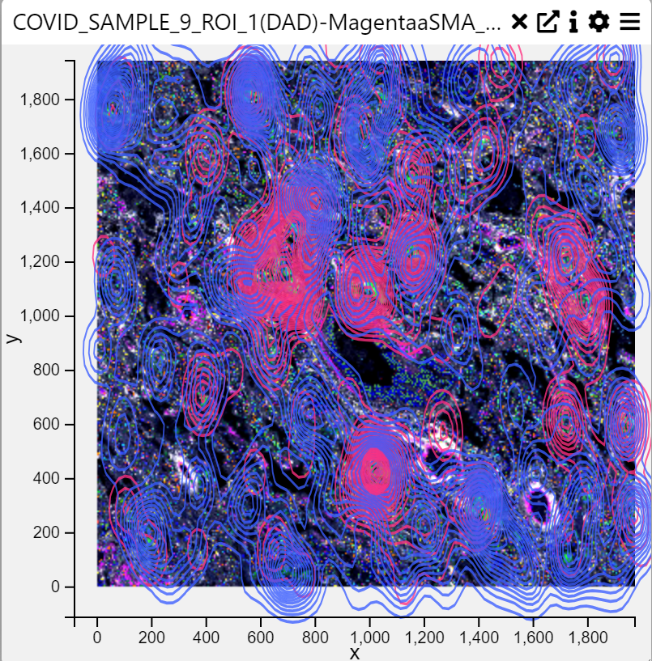

#### Context  
A **Density Scatter Plot** is a visualization that represents the density of data points in a two-dimensional space. It is useful for identifying clusters, patterns, and relationships between two numerical variables. The density is typically visualized using contours or color gradients.

#### Inputs  
- **X-axis** (numerical variable)  
- **Y-axis** (numerical variable)  
- **Category Column** (categorical variable, optional for grouping)  

#### Settings  
- **Chart Name** (customizable title)  
- **Chart Legend** (define or modify legend text)  
- **Point Opacity** (adjust transparency of individual data points)  
- **Point Size** (set size of data points for better visualization)  

#### Axis Controls  
- **X-axis & Y-axis Selection** (choose numerical variables for both axes)  
- **Rotate Y-axis Labels** (toggle label orientation for readability)  
- **Y-axis Text Size** (adjustable via slider)  
- **Y-axis Width** (modify axis width for layout optimization)  
- **Rotate X-axis Labels** (toggle orientation for better fit)  
- **X-axis Text Size** (adjustable via slider)  
- **X-axis Height** (modify spacing to accommodate longer labels)  

#### Color Settings  
- **Color By** (choose a variable for color encoding)  
- **Show Color Legend** (enable/disable color legend)  
- **SymLog Color Scale** (apply logarithmic scaling for better contrast)  
- **Trim Color Scale to Percentile** (adjust percentile range for color mapping)  
- **Treat Zero as Missing** (exclude zero values from visualization)  

#### Tooltip & Interaction  
- **Show Tooltip** (enable or disable tooltip display)  
- **Tooltip Value** (choose which information appears in the tooltip)  
- **Centre Plot** (reset and centre the visualization)  

#### Filtering & Display  
- **Action on Filter**  
  - **Hide Points** (remove filtered-out points)  
  - **Gray Out Points** (retain but dim non-selected points)  

- **Background Color**  
  - **None** (default)  
  - **White, Light Gray, Gray, Black** (set the background color)  

- **Brush Type** (Selection method for data)  
  - **Free Draw** (Allows drawing custom selection areas)  
  - **Rectangle** (Selects a rectangular area of data)  

#### Contour Settings  
- **Contour Parameter** (choose a variable for contour generation)  
- **Contour Categories** (up to two categories for subgroup contours)  
- **KDE Bandwidth** (adjust bandwidth for kernel density estimation)  
- **Fill Contours** (toggle whether to fill density contours)  
- **Fill Intensity** (control intensity of the filled contours)  
- **Contour Opacity** (adjust transparency of contour lines)  

---

### Dot Plot

#### Examples

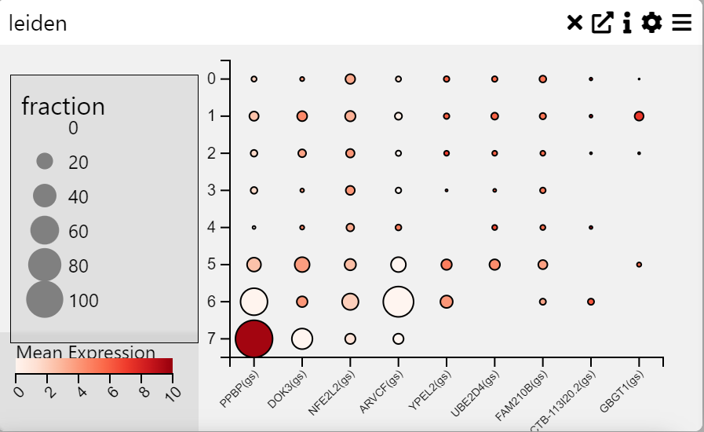

#### Context  
A **Dot Plot** is a graphical representation where individual data points are plotted along an axis to show frequency distributions, comparisons, or proportions. Each dot represents a value, and its size and color can be used to encode additional information. This chart is useful for visualizing categorical data with quantitative measures.

#### Inputs  
- **Categories on Y-axis** (categorical variable)  
- **Fields on X-axis** (numerical or categorical variable)  

#### Settings  
- **Chart Name** (customizable title)  
- **Chart Legend** (define or modify legend text)  

#### Axis Controls  
- **Rotate Y-axis Labels** (toggle label orientation for readability)  
- **Y-axis Text Size** (adjustable via slider)  
- **Y-axis Width** (modify axis width for layout optimization)  
- **Rotate X-axis Labels** (toggle orientation for better fit)  
- **X-axis Text Size** (adjustable via slider)  
- **X-axis Height** (modify spacing to accommodate longer labels)  
- **Right Y-axis Size** (adjust axis size for layout balance)  

#### Data Processing  
- **Cluster Rows** (group and order rows based on similarity)  
- **Cluster Columns** (group and order columns based on similarity)  
- **Averaging Method**  
  - **Mean** (average value calculation)  
  - **Median** (middle value calculation)  

#### Color Settings  
- **Show Color Legend** (enable/disable color legend)  
- **Log Color Scale** (apply logarithmic scaling for better contrast)  
- **Trim to Percentile**  
  - **No Trim**  
  - **0.001** (removes extreme values beyond this percentile)  
  - **0.01**  
  - **0.05**  

---

### Heat Map

#### Examples

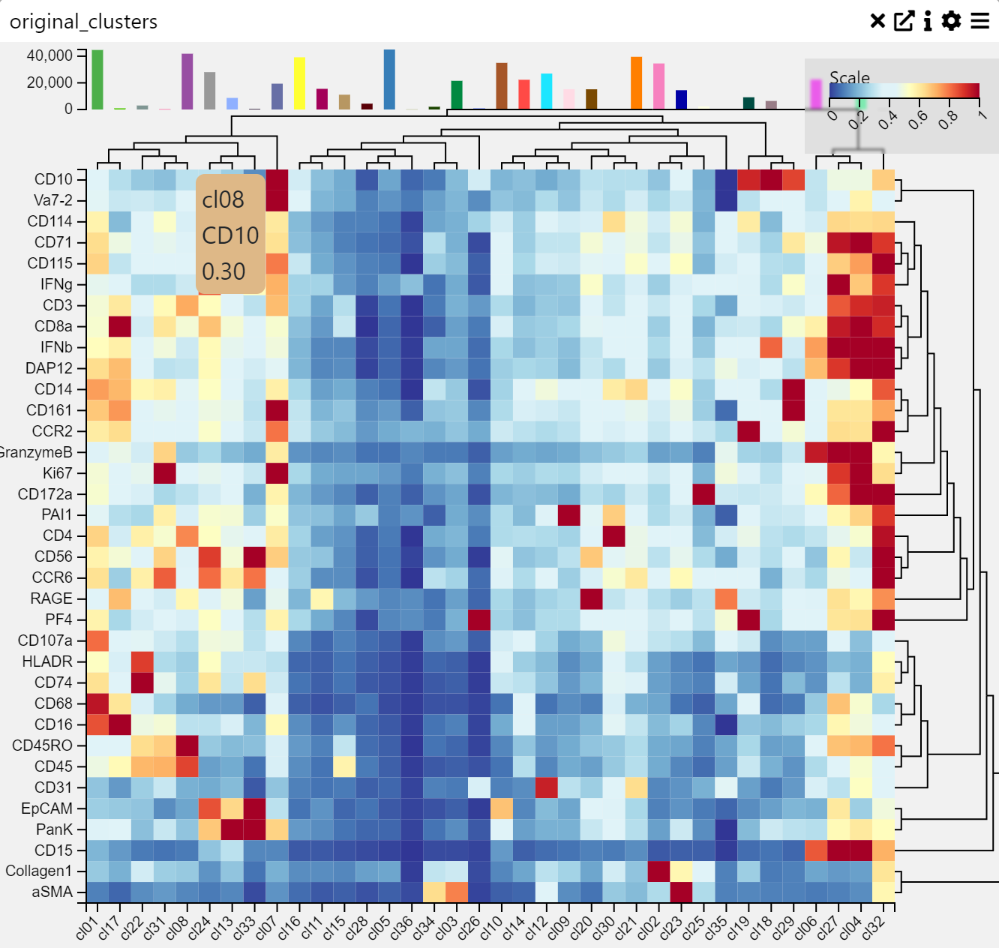

#### Context  
A **Heatmap** is a data visualization technique that represents values as colors in a matrix format. It is useful for identifying patterns, correlations, and variations across multiple data points. Colors indicate intensity or frequency, making heatmaps effective for comparative analysis.

#### Inputs  
- **Categories on Y-axis** (categorical variable)  
- **Fields on X-axis** (numerical or categorical variable)  

#### Settings  
- **Chart Name** (customizable title)  
- **Chart Legend** (define or modify legend text)  

#### Axis Controls  
- **Rotate Y-axis Labels** (toggle label orientation for readability)  
- **Y-axis Text Size** (adjustable via slider)  
- **Y-axis Width** (modify axis width for layout optimization)  
- **Rotate X-axis Labels** (toggle orientation for better fit)  
- **X-axis Text Size** (adjustable via slider)  
- **X-axis Height** (modify spacing to accommodate longer labels)  
- **Right Y-axis Size** (adjust axis size for layout balance)  

#### Data Processing  
- **Cluster Rows** (group and order rows based on similarity)  
- **Cluster Columns** (group and order columns based on similarity)  
- **Averaging Method**  
  - **Mean** (average value calculation)  
  - **Median** (middle value calculation)  

#### Color Settings  
- **Show Color Legend** (enable/disable color legend)  
- **Log Color Scale** (apply logarithmic scaling for better contrast)  
- **Trim to Percentile**  
  - **No Trim**  
  - **0.001** (removes extreme values beyond this percentile)  
  - **0.01**  
  - **0.05**  

---

### Histogram

#### Examples

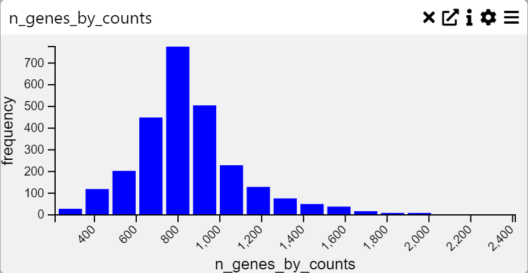

#### Context  
A **Histogram** is a graphical representation of the distribution of numerical data. It groups values into **bins** and displays the frequency of occurrences within each bin. This visualization is particularly useful for analyzing the shape, spread, and central tendency of a dataset.

#### Inputs  
- **Frequency Data** (numerical variable to be plotted)

#### Settings  
- **Chart Name** (customizable title)  
- **Chart Legend** (define or modify legend text)  

#### Axis Controls  
- **Rotate Y-axis Labels** (toggle label orientation for readability)  
- **Y-axis Text Size** (adjustable via slider)  
- **Y-axis Width** (modify axis width for layout optimization)  
- **Rotate X-axis Labels** (toggle orientation for better fit)  
- **X-axis Text Size** (adjustable via slider)  
- **X-axis Height** (modify spacing to accommodate longer labels)  

#### Data Processing  
- **Max-Min Values** (set minimum and maximum range for data representation)  
- **Number of Bins** (adjust bin count, min: 2, max: 100)  

---

### Multi Line Chart

#### Examples

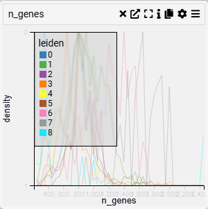

#### Context  
A **Line Plot** is used to visualize trends and patterns over time or continuous data. It connects data points with lines, making it ideal for identifying increases, decreases, and cyclical patterns.

#### Inputs  
- **Value (X-axis, numerical variable)**  
- **Categories (Y-axis, categorical variable)**  

#### Settings  
- **Chart Name** (customizable title)  
- **Chart Legend** (define or modify legend text)  
- **Change Categories (Y-axis)** (select or modify categorical grouping)  
- **Categories to Show** (filter displayed categories)  
- **Stack Lines** (toggle line stacking for clearer comparison)  
- **Fill Lines** (toggle fill area beneath the lines for emphasis)  

#### Axis Controls  
- **Rotate Y-axis Labels** (toggle label orientation for readability)  
- **Y-axis Text Size** (adjustable via slider)  
- **Y-axis Width** (modify axis width for layout optimization)  
- **Rotate X-axis Labels** (toggle orientation for better fit)  
- **X-axis Text Size** (adjustable via slider)  
- **X-axis Height** (modify spacing to accommodate longer labels)  

#### Display & Scale  
- **Scale/Trim to Percentile** (adjust the percentile range for data scaling)  
  - Options:  
    - **No Trim** (default, displays full range)  
    - **0.001, 0.01, 0.05** (trim outliers for focused display)  
- **Band Width** (adjustable for distribution smoothing)  
- **Intervals** (set number of divisions for better data segmentation)  
- **Show Color Legend** (toggle visibility of color-coded categories)  

---

### Pie Chart

#### Examples

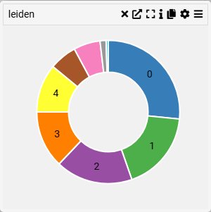

#### Context  
A **Category Bar Chart** visualizes categorical data distribution, where each category is represented by a bar whose length corresponds to its value. This type of chart is useful for comparing different groups within a dataset.

#### Inputs  
- **Category (X-axis, categorical variable)**  

#### Settings  
- **Chart Name** (customizable title)  
- **Chart Legend** (define or modify legend text)  

#### Parameters  
- **Category** (select the categorical variable to display)  

#### Axis Controls  
- **Rotate X-axis Labels** (toggle orientation for readability)  
- **X-axis Text Size** (adjustable via slider)  
- **X-axis Height** (modify spacing for better label visibility)  

---

### Row Chart

#### Examples

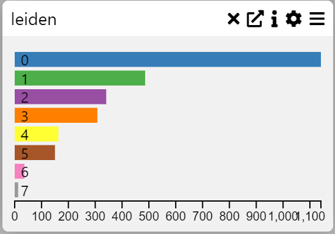

#### Context  
A **Row Chart** or **Category Frequency Chart** visualizes the frequency of categorical variables in a dataset. It helps identify patterns and compare the distribution of categories.

#### Inputs  
- **Category (X-axis, categorical variable)**  

#### Settings  
- **Chart Name** (customizable title)  
- **Chart Legend** (define or modify legend text)  

#### Parameters  
- **Category** (select the categorical variable to display)  

#### Axis Controls  
- **Rotate X-axis Labels** (toggle orientation for readability)  
- **X-axis Text Size** (adjustable via slider)  
- **X-axis Height** (modify spacing for better label visibility)  

#### Display Options  
- **Max Rows** (limit the number of displayed categories)  
- **Hide Zero Values** (option to exclude zero-frequency categories)  
- **Sort Order**  
  - **Default** (original order)  
  - **Size** (order by frequency)  
  - **Name** (alphabetical order)  
- **Display as WordCloud** (alternative visualization format)  
- **Show Tooltip** (enable/disable tooltip for additional information)  

### Row Summary Box

#### Examples

#### Context  
A **Row Summary Box** provides a compact summary of key values for a dataset's rows. It is useful for quick insights and comparisons between multiple attributes in tabular data.

#### Inputs  
- **Values to Display** (select the numerical variables to summarize)  

#### Settings  
- **Chart Name** (customizable title)  
- **Chart Legend** (define or modify legend text)  

#### Parameters  
- **Values to Display** (choose specific numerical fields to summarize)  

---

### Sankey Diagram

#### Examples

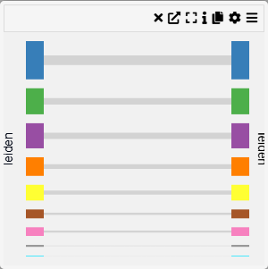

#### Context  
A **Group Comparison Chart** allows for a visual comparison between two selected categorical groups. This chart is useful for analyzing differences in distributions, frequencies, or statistical summaries across groups.

#### Inputs  
- **First Group** (select the first categorical group)  
- **Second Group** (select the second categorical group)  

#### Settings  
- **Chart Name** (customizable title)  
- **Chart Legend** (define or modify legend text)  

#### Parameters  
- **First Group** (choose the primary category for comparison)  
- **Second Group** (choose the secondary category for comparison)  

#### Axis Controls  
- **Rotate Y-axis Labels** (toggle orientation for readability)  
- **Y-axis Text Size** (adjustable via slider)  
- **Y-axis Width** (modify width for better label visibility)  

### Selection Dialog

#### Examples

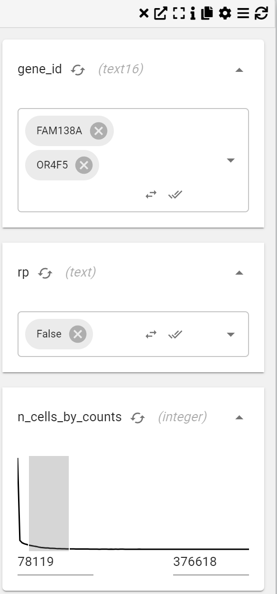

#### Context  
A **Selection Dialog** or **Column Filter Chart** enables the selection and filtering of specific columns within a dataset. This chart is useful for focusing on particular variables or subsets of data. 

For example, you may want to only show cells that have been derived from a particular disease. Assuming there is a disease column (of data type), You could add a "Disease" filter and that would show a drop down menu containing the disease categories that could be tuned on or off.

If this column was a numeric type, e.g. total_counts (counts of reads per cell) the selection dialogue would show a distribution that can be filtered by dragging a range over the distribution.

#### Inputs  
- **Columns to Filter** (choose which dataset columns should be filtered)  

#### Settings  
- **Chart Name** (customizable title)  
- **Chart Legend** (define or modify legend text)  
- **Select** particular columns to filter
  

#### Interactivity  
- **Clear Filters** (option to remove applied filters)  

### Stacked Row Chart

#### Examples

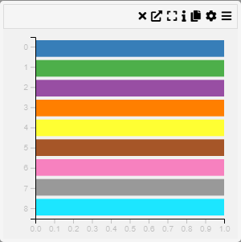

#### Context  
A **Stacked Row Chart** or **Categorical Heatmap** is a visualization that represents data through a color-coded matrix. Each cell in the heatmap corresponds to a category on the X and Y axes, with color intensity indicating the value of the relationship between them.

#### Inputs  
- **Category (X-axis, categorical variable)**  
- **Category (Y-axis, categorical variable)**  

#### Settings  
- **Chart Name** (customizable title)  
- **Chart Legend** (define or modify legend text)  

#### Parameters  
- **Category X-axis** (select the categorical variable for the horizontal axis)  
- **Category Y-axis** (select the categorical variable for the vertical axis)  

#### Axis Controls  
- **Rotate Y-axis Labels** (toggle orientation for readability)  
- **Y-axis Text Size** (adjustable via slider)  
- **Y-axis Width** (modify axis width for layout optimization)  
- **Rotate X-axis Labels** (toggle orientation for better fit)  
- **X-axis Text Size** (adjustable via slider)  
- **X-axis Height** (modify spacing for label accommodation)  
- **Right Y-axis Size** (adjust the width of the right-side Y-axis)  

#### Color & Sorting  
- **Show Color Legend** (enable or disable color legend)  
- **Sort Order**  
  - **Default** (maintain the dataset’s natural order)  
  - **Size** (sort by value size)  
  - **Name** (alphabetical sorting)  
  - **Composition** (sort based on composition criteria)  

### Table

#### Examples

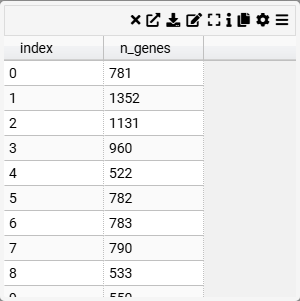

#### Context
A straightforward tabular display of data with sorting options. Useful for reviewing raw data.

#### Inputs  
- **Columns to Display** (select the columns to be included in the summary table)

#### Settings  
- **Chart Name** (customizable title)  
- **Chart Legend** (define or modify legend text)  

#### Parameters  
- **Columns to Display** (choose specific columns such as `n_genes`, `total_counts`, `leiden`, `cell_id`, etc.)  

#### Interaction & Filtering  
- **Column Display Modes**  
  - **Column** (display as a standard column)  
  - **Link** (convert column values to links)  
  - **Active Link** (interactive linking for dynamic filtering)  
- **Searchable & Sortable** (allow sorting and searching within the table)
---

### Text Box

#### Examples

#### Context  
A **Text Box** is a simple visualization component used to display markdown-formatted text. It is useful for adding descriptions, annotations, or contextual information to a dashboard.

#### Inputs  
- **Markdown Text** (customizable text content with support for markdown formatting)

#### Settings  
- **Chart Name** (customizable title)  
- **Chart Legend** (define or modify legend text)  
- **Markdown Text** (input area for entering markdown-formatted text)

#### Features  
- **Supports Markdown Syntax** (bold, italics, headers, lists, links, and more)  
- **Resizable** (adjust dimensions dynamically)  
- **Customizable Content** (allows users to input and modify text as needed)

This component is ideal for adding explanatory notes, instructions, or additional information to enhance the interpretability of data visualizations.

---

### 2D Scatter Plot

#### Examples

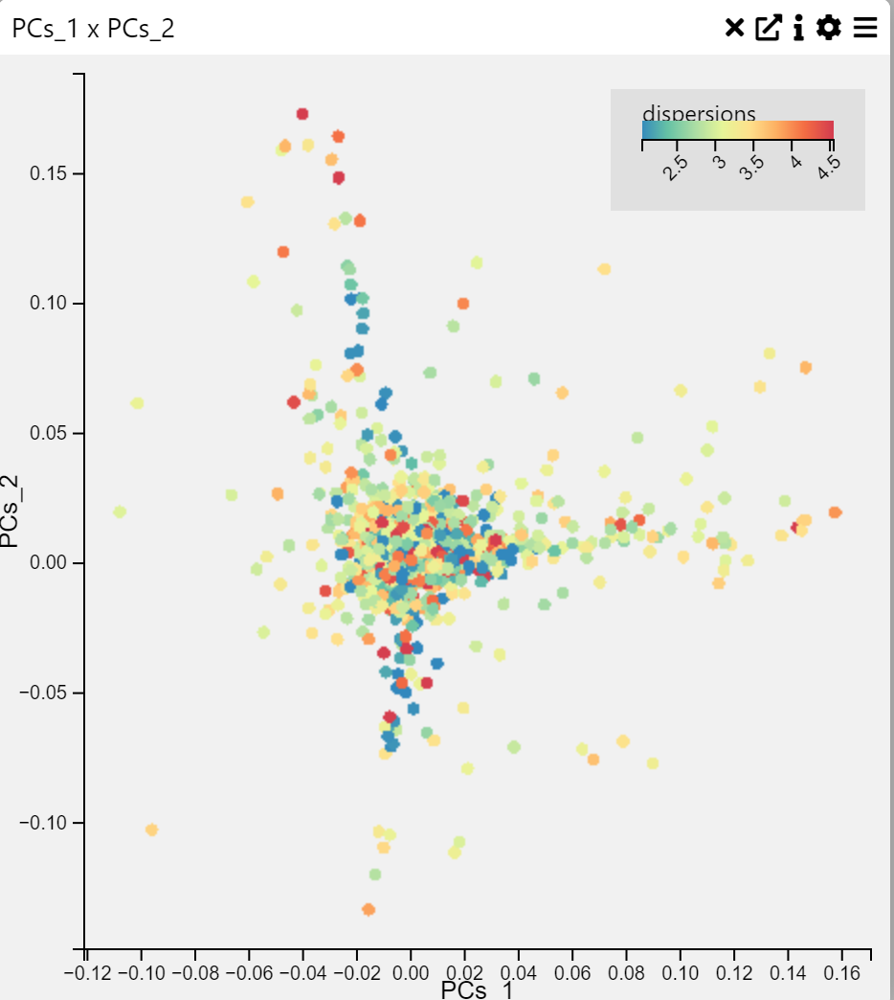

#### Context  
A **2D Scatter Plot** and **3D Scatter Plot** is a visualization that displays points on a two-dimensional graph to reveal relationships between two numerical variables. Each point represents an observation in the dataset.

#### Inputs  
- **X-axis** (numerical variable)  
- **Y-axis** (numerical variable)  

#### Settings  
- **Chart Name** (customizable title)  
- **Chart Legend** (define or modify legend text)  
- **Point Opacity** (adjust transparency of points)  
- **Point Size** (modify size of data points)  

#### Axis Controls  
- **X-axis** (select a column for X values)  
- **Y-axis** (select a column for Y values)  
- **Rotate Y-axis labels** (toggle rotation for readability)  
- **Y-axis text size** (adjust text size via slider)  
- **Y-axis width** (modify width for layout optimization)  
- **Rotate X-axis labels** (toggle rotation for better fit)  
- **X-axis text size** (adjust via slider)  
- **X-axis height** (modify spacing for long labels)  

#### Color Settings  
- **Color By** (choose a variable for color encoding)  
- **Show Color Legend** (enable/disable legend)  
- **SymLog Color Scale** (apply logarithmic scaling)  
- **Trim Color Scale** (adjust percentile range for color mapping)  
- **Treat Zero as Missing** (ignore zero values in visualization)  

#### Tooltip & Interaction  
- **Show Tooltip** (toggle tooltip display)  
- **Tooltip Value** (select which data appears in the tooltip)  
- **Centre Plot** (reset and center visualization)  

#### Filtering & Display  
- **Action on Filter**  
  - **Hide Points** (remove filtered-out points)  
  - **Gray Out Points** (dim non-selected points)  
- **Background Color**  
  - **None, White, Light Gray, Gray, Black**  

#### Brush & Selection  
- **Brush Type**  
  - **Free Draw** (polygonal selection)  
  - **Rectangle** (box selection)  

This scatter plot is a powerful way to visualize relationships between variables, detect clusters, and identify outliers in data.

---

### Violin Plot

#### Examples

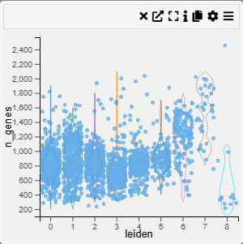

#### Context
Violin plots combine a **box plot** with a **density plot**, illustrating the full distribution shape for each category. Excellent for comparing distributions when you also want to see their shape.

#### Inputs  
- **Category (X-axis, categorical variable)**  
- **Value (Y-axis, numerical variable)**  

#### Settings  
- **Chart Name** (customizable title)  
- **Chart Legend** (define or modify legend text)  
- **Band Width** (adjustable width for smoothing)  
- **Intervals** (control the number of divisions in the density estimate)  
- **Point Opacity** (adjust transparency of individual data points)  
- **Point Size** (set size of data points for better visibility)  

#### Axis Controls  
- **Rotate Y-axis labels** (toggle label orientation for readability)  
- **Y-axis text size** (adjustable via slider)  
- **Y-axis width** (modify axis width for layout optimization)  
- **Rotate X-axis labels** (toggle orientation for better fit)  
- **X-axis text size** (adjustable via slider)  
- **X-axis height** (modify spacing to accommodate longer labels)  

#### Color Settings  
- **Color By** (choose a variable for color encoding)  
- **Show Color Legend** (enable/disable color legend)  
- **SymLog Color Scale** (apply logarithmic scaling for better contrast)  
- **Trim Color Scale** (adjust percentile range for color mapping)  
- **Treat Zero as Missing** (exclude zero values from visualization)  

#### Tooltip & Interaction  
- **Show Tooltip** (enable or disable tooltip display)  
- **Tooltip Value** (choose which information appears in the tooltip)  
- **Centre Plot** (reset and centre the visualization)  

#### Filtering & Display  
- **Action on Filter**  
  - **Hide Points** (remove filtered-out points)  
  - **Gray Out Points** (retain but dim non-selected points)  

---

### Word Cloud

#### Examples

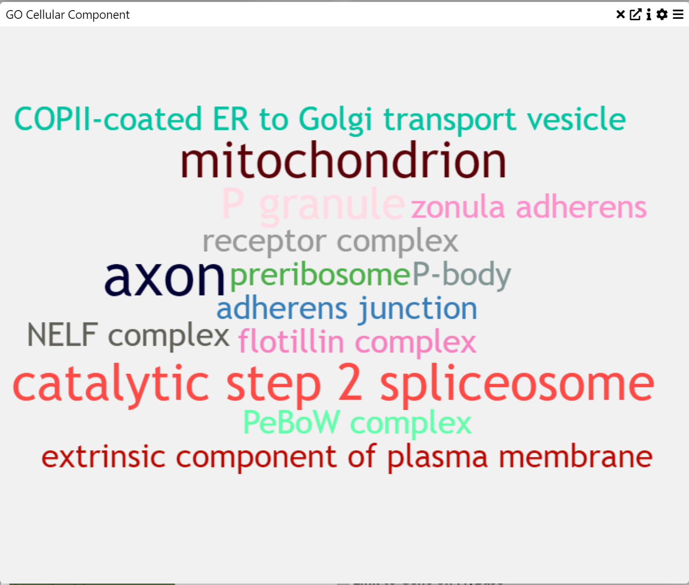

#### Context  
A **word cloud** is a visual representation of text data where the size of each word corresponds to its frequency or importance. This type of visualization is useful for quickly identifying key themes in a dataset.

#### Inputs  
- **Text Data** (words or phrases from a dataset)  

#### Settings  
- **Word Size** (adjust the relative size of words in the visualization)  

---

## Exporting Data

When in a Table chart, click the **Download** icon (⬇️) to export filtered data. Only visible columns are downloaded, so make sure to expand or unhide columns if needed.

---

## Permissions

Two permission levels exist:
1. **View**: Users can see the project but not save changes.
2. **Edit**: Users can add/change charts, save, and run jobs.

### Sharing a Project

1. Click **Share** (🔗) → **Share Project**.
2. Enter another user’s name.
3. Select permission level (View/Edit).
4. Click **Add**.
5. Remove users with the trash icon.

### Making a Project Public

- Click **Share** (🔗) → **Make Public**.
- Anyone with the link can now view.

---

## Submitting an Issue

1. Click **Help** (❓) → **Send Question** to message the MDV support mdv@cmd.ndm.ox.ac.uk
2. Or file an issue on [GitHub](https://github.com/Taylor-CCB-Group/MDV/issues).

---

## FAQ

**Can MDV be viewed on a mobile device?**  
No. MDV’s interface relies on multiple panels and is optimized for larger screens.

**Do I need special packages to load .h5ad files?**  
No, the server handles AnnData internally. Just upload your file.

**What if my file is larger than 2GB?**  
Use the MDV API or contact support.
